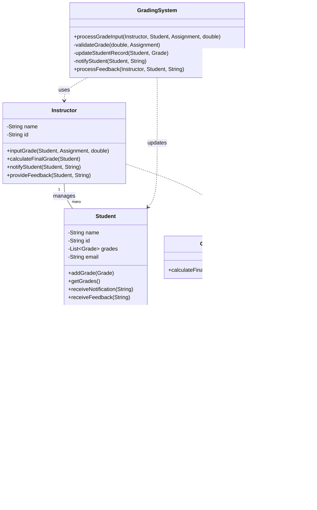

# Lab OOAD report

Member name:

- Tran Hoang Doanh  - ITITWE23016
- Nguyễn Thiện Nghĩa  - ITDSIU20071

# Concept of OOP, SOLID and Designing Pattern

# Object-Oriented Programming (OOP)

OOP is a programming paradigm that organizes code around objects, which are instances of classes. The main principles of OOP are:

## 1. Encapsulation

Bundling data and methods that operate on that data within a single unit (class). It hides internal details and provides an interface for interacting with the object.

## 2. Abstraction

Simplifying complex systems by modeling classes based on the essential properties and behaviors they share.

## 3. Inheritance

Allowing new classes to be based on existing classes, inheriting their attributes and methods.

## 4. Polymorphism

The ability of objects to take on multiple forms and respond to the same method call differently based on their specific implementation.


# SOLID Principles

SOLID is an acronym for five design principles aimed at making software designs more understandable, flexible, and maintainable:

## 1. Single Responsibility Principle (SRP)

A class should have only one reason to change, meaning it should have only one job or responsibility.

## 2. Open-Closed Principle (OCP)

Software entities should be open for extension but closed for modification.

## 3. Liskov Substitution Principle (LSP)

Objects of a superclass should be replaceable with objects of its subclasses without affecting the correctness of the program.

## 4. Interface Segregation Principle (ISP)

Many client-specific interfaces are better than one general-purpose interface.

## 5. Dependency Inversion Principle (DIP)

High-level modules should not depend on low-level modules. Both should depend on abstractions.


# Design Patterns

Design patterns are typical solutions to common problems in software design. They can be categorized into three main types:

## 1. Creational Patterns

These patterns deal with object creation mechanisms. Examples include:

- Singleton: Ensures a class has only one instance and provides a global point of access to it.
- Factory Method: Defines an interface for creating an object, but lets subclasses decide which class to instantiate.
- Abstract Factory: Provides an interface for creating families of related or dependent objects.

## 2. Structural Patterns

These patterns deal with object composition. Examples include:

- Adapter: Allows incompatible interfaces to work together.
- Decorator: Adds new responsibilities to an object dynamically.
- Composite: Composes objects into tree structures to represent part-whole hierarchies.

## 3. Behavioral Patterns

These patterns deal with communication between objects. Examples include:

- Observer: Defines a one-to-many dependency between objects so that when one object changes state, all its dependents are notified.
- Strategy: Defines a family of algorithms, encapsulates each one, and makes them interchangeable.
- Command: Encapsulates a request as an object, allowing parameterization of clients with queues, requests, and operations.


These concepts form the foundation of modern software design and architecture, promoting code reusability, maintainability, and scalability.

# Grading Process for Students:

# Class Diagram




# Pseudocode

```
class GradingSystem:
    function processGradeInput(instructor, student, assignment, score):
        if not validateGrade(score, assignment):
            throw InvalidGradeException("Grade does not meet minimum passing score")
        
        grade = new Grade(score, assignment.weight)
        updateStudentRecord(student, grade)
        
        if isAssignmentFinal(assignment):
            finalGrade = instructor.calculateFinalGrade(student)
            notifyStudent(student, "Your final grade is: " + finalGrade)
        else:
            notifyStudent(student, "New grade recorded for " + assignment.name)

    function validateGrade(score, assignment):
        return score >= assignment.minimumPassingScore

    function updateStudentRecord(student, grade):
        student.addGrade(grade)

    function notifyStudent(student, message):
        student.receiveNotification(message)

    function processFeedback(instructor, student, feedback):
        latestGrade = student.getGrades().getLast()
        latestGrade.setFeedback(feedback)
        student.receiveFeedback("New feedback available for " + latestGrade.getAssignment().name)

class Instructor:
    function inputGrade(student, assignment, score):
        GradingSystem.processGradeInput(this, student, assignment, score)
    
    function calculateFinalGrade(student):
        grades = student.getGrades()
        return GradeCalculator.calculateFinalGrade(grades)

    function provideFeedback(student, feedback):
        GradingSystem.processFeedback(this, student, feedback)

class Student:
    function addGrade(grade):
        grades.add(grade)
    
    function getGrades():
        return grades
    
    function receiveNotification(message):
        print("Notification for " + this.name + ": " + message)

    function receiveFeedback(message):
        print("Feedback for " + this.name + ": " + message)

class Grade:
    function getWeightedScore():
        return score * weight

    function setFeedback(feedback):
        this.feedback = feedback

    function getFeedback():
        return feedback

class GradeCalculator:
    function calculateFinalGrade(grades):
        totalWeightedScore = 0
        totalWeight = 0
        for each grade in grades:
            totalWeightedScore += grade.getWeightedScore()
            totalWeight += grade.weight
        
        if totalWeight == 0:
            return 0
        else:
            return totalWeightedScore / totalWeight

// Main process
try:
    instructor = new Instructor("Dr. Smith", "INST001")
    student = new Student("John Doe", "STU001", "john@example.com")
    assignment = new Assignment("Final Exam", "Exam", 0.4, 50.0)
    
    instructor.inputGrade(student, assignment, 75.0)
    instructor.provideFeedback(student, "Good work on the final exam. Your analysis was thorough.")
catch InvalidGradeException as e:
    print("Error: " + e.message)
    // Handle the error (e.g., ask for grade re-entry)
```

# Key Features

## 1. Central Function

The central functions of this process are the inputGrade method in the Instructor class, which uses the GradingSystem to process the grade input, and the new provideFeedback method, which allows instructors to give detailed feedback on assignments.

## 2. Error Handling

The validateGrade function in GradingSystem checks if the entered grade meets the minimum passing score for the assignment. If not, it throws an InvalidGradeException.

## 3. Notification Mechanism

The notifyStudent function in GradingSystem sends notifications to students when new grades are recorded or when final grades are calculated. The new receiveFeedback function in Student class notifies students when new feedback is available.

## 4. Feedback System

The new processFeedback function in GradingSystem allows instructors to provide detailed feedback on assignments. This feedback is stored with the corresponding Grade object and can be accessed by students.

## 5. OOP Principles

This design adheres to OOP principles such as encapsulation (each class encapsulates its data and behavior), abstraction (GradingSystem abstracts the grading and feedback processes), and the Single Responsibility Principle (each class has a single, well-defined responsibility).

## 6. Error Handling in Main Process

The main process demonstrates how to handle potential errors, such as invalid grades, using a try-catch block.

This enhanced design provides a more comprehensive grading system that not only allows for grade input and calculation but also incorporates a feedback mechanism for instructors to provide detailed comments on student work. This addition enhances the educational value of the grading process and improves communication between instructors and students.
